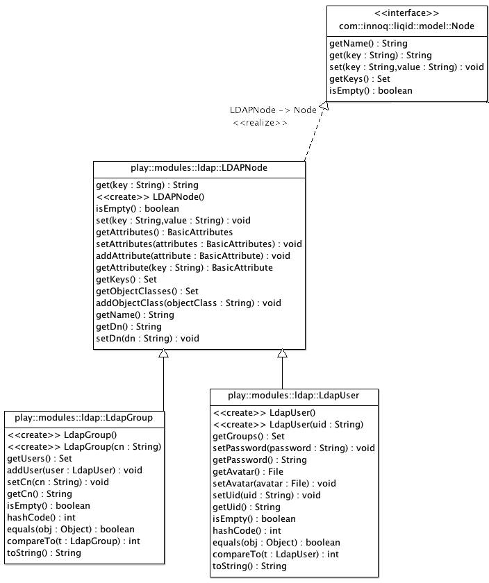

LiQID
=====

LDAP innoQ ID Manager

This is Library should help java developers to use LDAP-Directories in a simple way. Without the hazzle of JNDI (Java Naming and Directory Interface).

Model
-------------

Utils
-------------

LDAP-Connector
-------------

Building:

You need a proper Configuration in a properties file.
There are 3 possibilities to define the location of this file:

1. via Code with setting Configuration.setPropertiesFile(....) before you instantiate the LDAPHelper.
2. store the file in the default location: user_dir/.liqid/liqid.properties
3. use the Enviroment Variabel LIQID_PROPERTIES to set the location of the properties file.

A valid properties file looks like this:

    #LDAP Settings
    default.ldap=ldap1
    # LDAP Listsing, divided by ","
    #ldap.listing=ldap1,ldap2
    ldap.listing=ldap1

    ldap.user.objectClasses=top, organizationalPerson, inetOrgPerson, person, posixAccount, shadowAccount,  JabberAccount, ldapPublicKey
    ldap.group.objectClasses=groupOfNames, shadowAccount
    ldap.sshKey=<!-- no key -->
    ldap.jabberServer=jabber.example.com
    ldap.mobile=0000

    ldap1.base_dn=dc=example,dc=com
    ldap1.ou_people=ou=People
    ldap1.ou_group=ou=Group

    # should OUs be autocreatet if they not exist?
    ldap1.ou.autocreate=true
    ldap1.url=ldaps://ldap.example.com:636
    ldap1.principal=cn=admin,dc=example,dc=com
    ldap1.credentials=secret'

### Loading a User from the LDAP Directory

    public void testUserLoad() {
        // loads an user with uid "test" from LDAP
        LdapUser ldapUser = (LdapUser) HELPER.getUser("test");
        // loads a preset test-user
        LdapUser testUser = getTestUser();
        // compares both users
        LOG.log(Level.INFO, "testUser: {0}", testUser);
        LOG.log(Level.INFO, "ldapUser: {0}", ldapUser);
        assertTrue("should be test: " + testUser + " ldap: " + ldapUser, testUser.equals(ldapUser));
    }
	
### Creating a new User in the LDAP Directory

    public void testUserCreate() {
        LdapUser user = HELPER.getUserTemplate("foobar");
        try {
            if (HELPER.setUser(user)) {
                LOG.log(Level.INFO, "created User {0}", user.getName());
            }
        } catch (Exception ex) {
            LOG.log(Level.SEVERE, "setUser fails", ex);
        }
        user = HELPER.getUser("foobar");
        assertFalse(user.isEmpty());
    }	

Legal
=====

  Copyright (C) 2012 innoQ Deutschland GmbH

  Licensed under the Apache License, Version 2.0 (the "License");
  you may not use this file except in compliance with the License.
  You may obtain a copy of the License at

  http://www.apache.org/licenses/LICENSE-2.0

  Unless required by applicable law or agreed to in writing, software
  distributed under the License is distributed on an "AS IS" BASIS,
  WITHOUT WARRANTIES OR CONDITIONS OF ANY KIND, either express or implied.
  See the License for the specific language governing permissions and
  limitations under the License.
